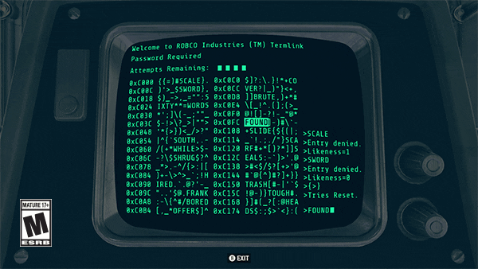

# Linux CLI - Introduction

In this module we will see what is behind this black and white text windows and how to make it a close friend!

Please follow the order of the exercices, it makes a sense. ;)

- [01. Introduction](01.introduction.md)
- [02. Drills](02.drills.md)
- [03. Commands](03.commands.md)
- [04. Terminus](04.Terminus.md)

Enjoy your travel!

